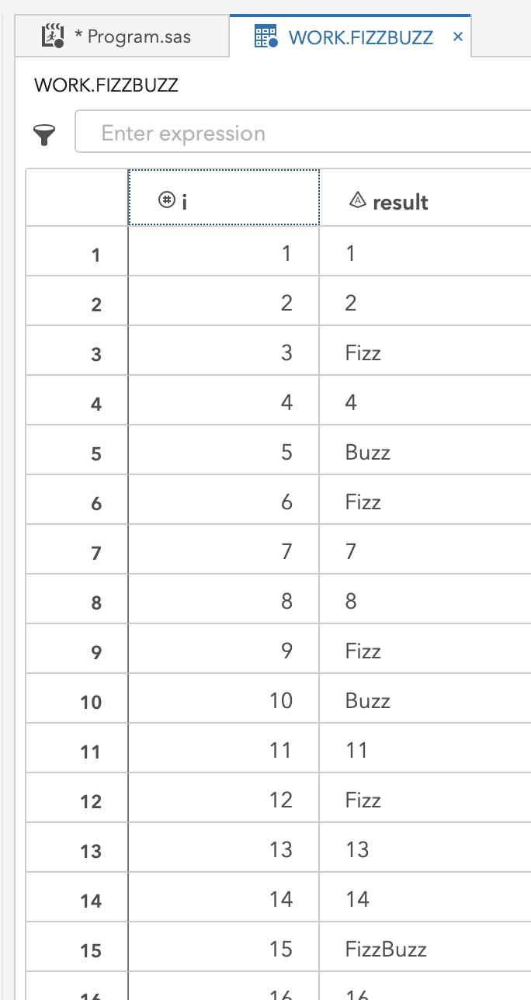
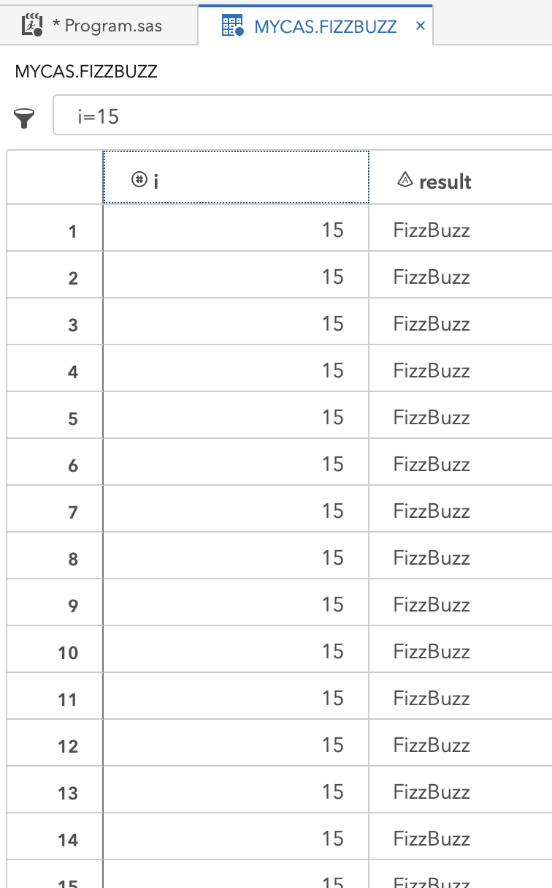
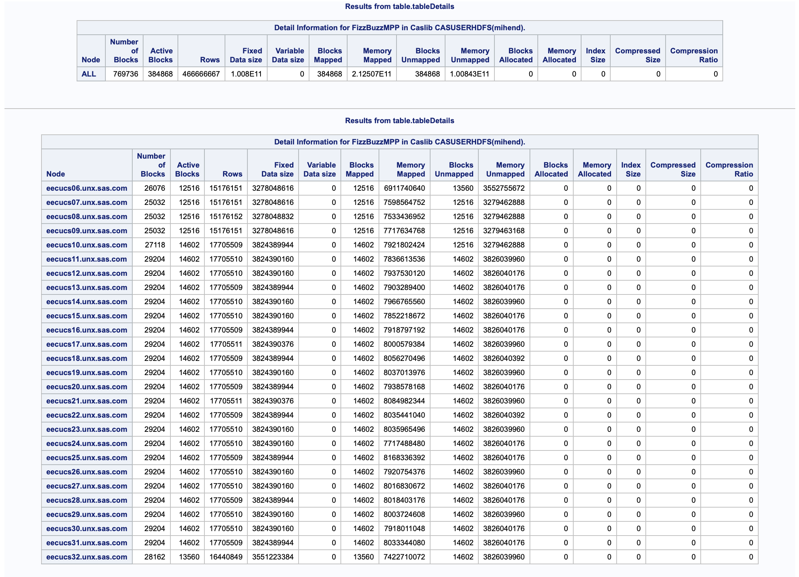

## (in progress) A classic programming challenge addressed with SAS, including a highly multi-threaded twist!

Table of Contents
- [FizzBuzz logic](#fizzbuzz-logic)
- [FizzBuzz with SAS](#fizzbuzz-with-sas)
- FizzBuzz with SAS Viya's CAS engine
	- [Replicating the single-threaded approach of SAS](#replicating-the-single-threaded-approach-of-sas)
	- [Invoking threads](#invoking-threads)
	- [Understanding threads](#understanding-threads)
	- [Putting all threads to work](#putting-all-threads-to-work)
	- [Orchestrating threads to work together](#orchestrating-threads-to-work-together)
- Bonus Sections
	- [Using SAS Viya CASL coding](#using-sas-viya-casl-coding)
	- [Using SAS Viya CASL coding from Python](#using-sas-viya-casl-coding-from-python)

---
## FizzBuzz Logic

general logic
```
Loop over positive integers
	if divisble by 3 then fizz
	if divisible by 5 then buzz
	if divisible by 3 & 5 then fizzbuzz
```

efficiency
```
Loop over positive integers
	if divisible by 3 then fizz
		if divisible by 5 then fizzbuzz
	else if divisible by 5 then buzz
```

---
## FizzBuzz with SAS

sas version of the logic
```sas
do until(i = 10000);
	i+1
	/* if divide by 3 */
	ifc(mod(i,3)=0,
		/* else if divide by 5 then fizzbuzz, else fizz */
		ifc(mod(i,5)=0,'FizzBuzz','Fizz'),
	/* id divide by 5 then buzz */
	ifc(mod(i,5)=0,'Buzz',
	/* else nothing '' */
	''))
end;									
```

sas version condenced and output
```sas
do until(i = 10000);
	i+1;
	result = strip(ifc(mod(i,3)=0,ifc(mod(i,5)=0,'FizzBuzz','Fizz'),ifc(mod(i,5)=0,'Buzz','')));
	if missing(result)=0 then output;
end;
```

FizzBuzz with SAS
```sas
/* SAS: FizzBuzz with Data Step */
	data FizzBuzz;
		do until(i = 10000);
			i+1;
			result = strip(ifc(mod(i,3)=0,ifc(mod(i,5)=0,'FizzBuzz','Fizz'),ifc(mod(i,5)=0,'Buzz','')));
			if missing(result)=0 then output;
		end;
	run;
```

```
NOTE: The data set WORK.FIZZBUZZ has 4667 observations and 2 variables.
NOTE: DATA statement used (Total process time):
      real time           0.00 seconds
      cpu time            0.01 seconds
```


---
## Replicating the single-threaded approach of SAS

Start a SAS Viya CAS session
```sas
/* setup a cas session */
	cas mysess;
	libname mycas cas sessref=mysess;
```

```
NOTE: The session MYSESS connected successfully to Cloud Analytic Services eecucs05.unx.sas.com using port 5570. The UUID is 
      30195d31-43df-e240-8ba1-f3d67f22bab3. The user is mihend and the active caslib is CASUSERHDFS(mihend).
NOTE: The SAS option SESSREF was updated with the value MYSESS.
NOTE: The SAS macro _SESSREF_ was updated with the value MYSESS.
NOTE: The session is using 27 workers.
77    libname mycas cas sessref=mysess;
NOTE: Libref MYCAS was successfully assigned as follows: 
      Engine:        CAS 
      Physical Name: 30195d31-43df-e240-8ba1-f3d67f22bab3
```

FizzBuzz with SAS Viya CAS - single thread
```sas
/* single thread version */
	data mycas.FizzBuzz / single=yes;
		do until(i = 10000);
			i+1;
			result = strip(ifc(mod(i,3)=0,ifc(mod(i,5)=0,'FizzBuzz','Fizz'),ifc(mod(i,5)=0,'Buzz','')));
			if missing(result)=0 then output;
		end;
	run;
```

```
NOTE: Running DATA step in Cloud Analytic Services.
NOTE: The table FizzBuzz in caslib CASUSERHDFS(mihend) has 4667 observations and 2 variables.
NOTE: DATA statement used (Total process time):
      real time           0.21 seconds
      cpu time            0.00 seconds
```

---
## Invoking threads

FizzBuzz with SAS Viya CAS - all threads
```sas
/* many thread version */
	data mycas.FizzBuzz / single=no;
		do until(i = 10000);
			i+1;
			result = strip(ifc(mod(i,3)=0,ifc(mod(i,5)=0,'FizzBuzz','Fizz'),ifc(mod(i,5)=0,'Buzz','')));
			if missing(result)=0 then output;
		end;
	run;
```

```
NOTE: Running DATA step in Cloud Analytic Services.
NOTE: The table FizzBuzz in caslib CASUSERHDFS(mihend) has 1726790 observations and 2 variables.
NOTE: DATA statement used (Total process time):
      real time           0.32 seconds
      cpu time            0.00 seconds
```



---
## Understanding threads

How many computing threads are available to SAS Viya CAS in this environment?
```sas
/* how many threads? hosts? */
	data mycas.seethreads / single=no;
		host=_hostname_;
		thread=_threadid_;
		put host thread;
	run;
```


---
## Putting all threads to work

FizzBuzz on SAS Viya CAS - all threads doing unique work
```sas
/* do work on each thread in cas */
	%LET fbsize = 10000;
	data mycas.FizzBuzzMPP / single=no;
		thread=_threadid_;
		i = (thread - 1) * &fbsize; /* start value for i on the thread */
		s = i + &fbsize; drop s; /* stop value for i on the thread */
		do until(i = s);
			i+1;
			result = strip(ifc(mod(i,3)=0,ifc(mod(i,5)=0,'FizzBuzz','Fizz'),ifc(mod(i,5)=0,'Buzz','')));
			if missing(result)=0 then output;
		end;
	run;
```


---
## Orchestrating threads to work together

FizzBuzz on SAS Viya CAS - all threads doing unique work
```sas
/* spread the work over all threads */
%LET threads = 370;
%LET fbsize = 10000;
data mycas.FizzBuzzMPP / single=no;
	extras = mod(&fbsize,&threads-1); drop extras;
	part_size = int(&fbsize/(&threads-1)); drop part_size;
	thread=_threadid_;

	i = (thread - 1) * part_size;
	s = i + part_size; drop s;
	if thread = &threads then do;
		i = &fbsize - extras;
		s = &fbsize;
	end;
	do until(i = s);
		i+1;
		result = strip(ifc(mod(i,3)=0,ifc(mod(i,5)=0,'FizzBuzz','Fizz'),ifc(mod(i,5)=0,'Buzz','')));
		if missing(result)=0 then output;
	end;
run;
```

```
NOTE: Running DATA step in Cloud Analytic Services.
NOTE: The table FizzBuzzMPP in caslib CASUSERHDFS(mihend) has 4667 observations and 3 variables.
NOTE: DATA statement used (Total process time):
      real time           0.21 seconds
      cpu time            0.01 seconds
```

```sas
/* spread the work over all threads */
%LET threads = 370;
%LET fbsize = 1000000000;
data mycas.FizzBuzzMPP / single=no;
	extras = mod(&fbsize,&threads-1); drop extras;
	part_size = int(&fbsize/(&threads-1)); drop part_size;
	thread=_threadid_;

	i = (thread - 1) * part_size;
	s = i + part_size; drop s;
	if thread = &threads then do;
		i = &fbsize - extras;
		s = &fbsize;
	end;
	do until(i = s);
		i+1;
		result = strip(ifc(mod(i,3)=0,ifc(mod(i,5)=0,'FizzBuzz','Fizz'),ifc(mod(i,5)=0,'Buzz','')));
		if missing(result)=0 then output;
	end;
run;
```

```
NOTE: Running DATA step in Cloud Analytic Services.
NOTE: The table FizzBuzzMPP in caslib CASUSERHDFS(mihend) has 466666667 observations and 3 variables.
NOTE: DATA statement used (Total process time):
      real time           28.08 seconds
      cpu time            0.42 seconds
```


---
## Using SAS Viya CASL coding

FizzBuzz on SAS Viya CAS with CASL code from PROC CAS
```sas
%LET threads = 370;
%LET fbsize=10000;
proc cas;
	dscode="
		data FizzBuzzMPP;
			extras = mod(&fbsize,&threads-1); drop extras;
			part_size = int(&fbsize/(&threads-1)); drop part_size;
			thread=_threadid_;

			i = (thread - 1) * part_size;
			s = i + part_size; drop s;
			if thread = &threads then do;
				i = &fbsize - extras;
				s = &fbsize;
			end;
			do until(i = s);
				i+1;
				result = strip(ifc(mod(i,3)=0,ifc(mod(i,5)=0,'FizzBuzz','Fizz'),ifc(mod(i,5)=0,'Buzz','')));
				if missing(result)=0 then output;
			end;
		run;";
	datastep.runcode / code=dscode single='no';

	table.tableDetails / table="FizzBuzzMPP";
	table.tableDetails / table="FizzBuzzMPP" level="NODE";
run;
```



---

End SAS Viya CAS session
```sas
/* end the cas session */
	cas mysess clear;
```

---
## Using SAS Viya CASL coding from Python

Running from Python Via SWAT
```python
import swat
```
