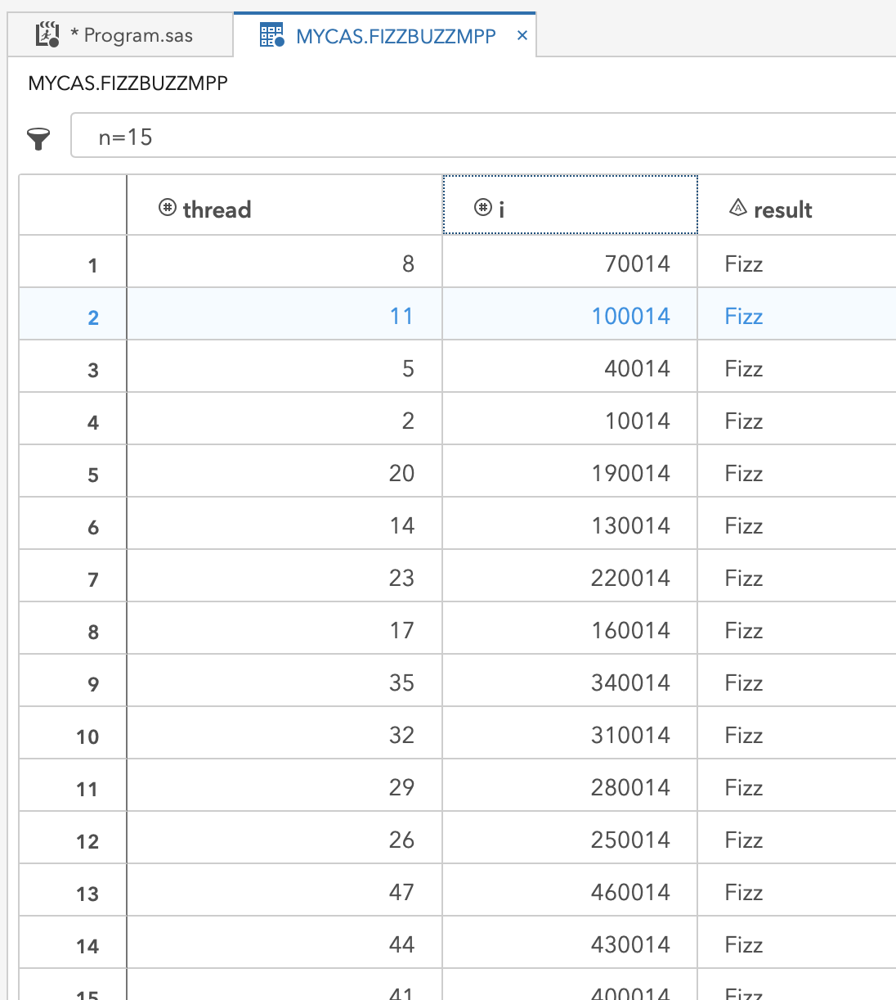
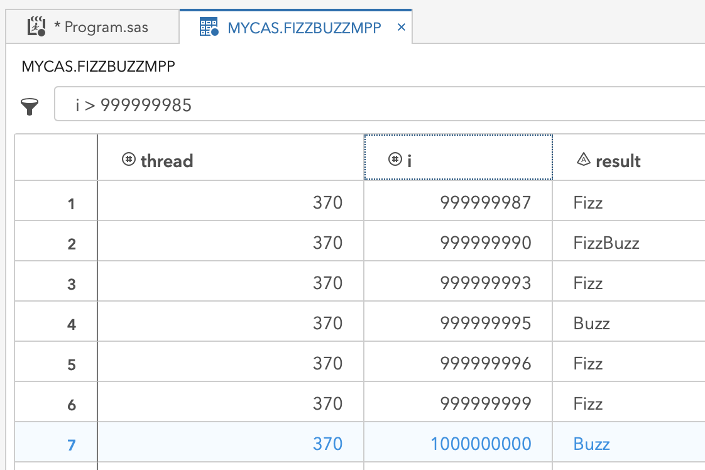

## (in progress) A classic programming challenge addressed with SAS, including a highly multi-threaded twist!


For this post, I address a classic programming challenge with multi-threading. Have you ever heard of FizzBuzz?  Count from 1, and for each integer, evaluate it for divisibility by 3 or 5.  If yes for 3, output 'fizz,' yes for 5, then 'buzz,' both means 'fizzbuzz.'  While this is highly sequential, counting through integers is blatantly parallel if you give different processors a different range of integers to evaluate.

When I learn a new programming language, I like to take challenges like this and see how to implement it best.  That means to run, run fast, and need a minimal number of characters to instruct the processing to commence.  With SAS, this is an easy challenge.  With SAS Viya's CAS engine, the parallelization is easy to orchestrate and super fast - think 1 BILLION integers evaluated in less than 30 seconds.  Sound interesting?  Read on!

### Outline
- [FizzBuzz logic](#fizzbuzz-logic)
- [FizzBuzz with SAS](#fizzbuzz-with-sas)
- FizzBuzz with SAS Viya's CAS engine
    - [Replicating the single-threaded approach of SAS with the SAS Viya multi-threaded CAS runtime](#replicating-the-single-threaded-approach-of-sas-with-the-sas-viya-multi-threaded-cas-runtime)
    - [Invoking threads](#invoking-threads)
    - [Understanding threads](#understanding-threads)
    - [Putting all threads to work](#putting-all-threads-to-work)
    - [Orchestrating threads to work together](#orchestrating-threads-to-work-together)
- Bonus Sections
    - [Using SAS Viya CASL coding](#using-sas-viya-casl-coding)
    - [Using SAS Viya CASL coding from Python](#using-sas-viya-casl-coding-from-python)

---
## FizzBuzz Logic

Before we jump into programming, let's take a look at the logic.  The reason fizzbuzz makes a good interview question is that it is easily stated and showcases a candidate's initial impressions.  I like to think about two approaches when facing a challenge: general logic, efficient logic.  

**General Logic**

The general approach is to iterate through integers and evaluate each integer for several conditions.  Is it divisible by 3, 5, or both?  There is also an overall else condition where we return the integer itself.  I like the indented list, outlining approach, for writing out logic.

```
Loop over positive integers
    if divisible by 3 then fizz
    if divisible by 5 then buzz
    if divisible by 3 & 5 then fizzbuzz
    if not divisible by 3 or 5 then print the integer
```

**Efficient Logic**

Efficient approaches reduce the number of evaluations to help the code run faster.  In this challenge, we don't need to evaluate for fizzbuzz if the number is not divisible by 3 (or 5).  For this reason, we can make fizzbuzz a nested (else) condition under the check for 3 (or 5).  Since fizzbuzz evaluates under one of the conditions, 3 in this example, we can evaluate for fizzbuzz as a condition (else) to fizz. 


```
Loop over positive integers
    if divisible by 3 then
        if divisible by 5 then fizzbuzz
        else fizz
    else if divisible by 5 then buzz
    else print integer
```

There are other tips for efficiency on this challenge that are available with a web search.  Some of these focus on a different type of multi-threading, where different threads do the 'fizz,' 'buzz,' and 'fizzbuzz' evaluation.  Those approaches may be more efficient for low thread count environments, like a personal computer, but are too limited for the approach I take here.

---
## FizzBuzz with SAS

Converting from logic to the syntax of the chosen programming language, SAS, in this case, is the most crucial step.  This conversion requires knowing the right functions, operation syntax, and how to direct the processing efficiently. Each programming language offers flexibility to implement logic in many ways.  The correct choices for efficiency are essential.  A description of my choices precedes the SAS data step syntax here.

- **loop over positive integers** using a `do until()` loop with the stop condition being the highest value of integer to evaluate.  In each iteration of the loop `i` increments and the looping stops when the incrementing forces `i` past `i =  10000`.
- **if/then/else** with the `ifc()` function has three inputs: the condition, the action to take on true, the action to take on false.  
    - nesting another `ifc()` function with the 'then' action allows the conditional divisibility by 5 to happen after checking for divisibility by 3 to determine 'fizzbuzz' efficiently
- **evaluate divisibility** with the `mod()` function where a remainder of 0 indicates divisibility of the first input, `i,` by the second input  
- **output integers** as text using the `put()` function

```sas
do until(i = 10000);
    i+1
    /* if divide by 3 */
    ifc(mod(i,3)=0,
        /* else if divide by 5 then fizzbuzz, else fizz */
        ifc(mod(i,5)=0,'FizzBuzz','Fizz'),
    /* id divide by 5 then buzz */
    ifc(mod(i,5)=0,'Buzz',
    /* else i '' */
    put(i,8.)))
end;                                    
```

Condensing the logic above into single rows for each step yields a step-by-step logic flow in the SAS syntax.  The conditional logic step gets wrapped in the `strip()` function to remove leading and trailing blanks that may occur due to different lengths of output.  The inclusion of the `output` statement directs the writing of results to the output destination during each iteration of the `do unitl()` loop.

```sas
do until(i = 10000);
    i+1;
    result = strip(ifc(mod(i,3)=0,ifc(mod(i,5)=0,'FizzBuzz','Fizz'),ifc(mod(i,5)=0,'Buzz',put(i,8.))));
    output;
end;
```

Execution with the SAS runtime is triggered when the logic above gets blocked with a SAS Data Step.  This step runs the logic and outputs as directed to the specified data set, `FizzBuzz,` that is stored in the `work` library by default.

```sas
/* SAS: FizzBuzz with Data Step */
    data FizzBuzz;
        do until(i = 10000);
            i+1;
            result = strip(ifc(mod(i,3)=0,ifc(mod(i,5)=0,'FizzBuzz','Fizz'),ifc(mod(i,5)=0,'Buzz',put(i,8.))));
            output;
        end;
    run;
```

The log from the above code indicates the requested 10000 evaluations created a data set in `WORK.FIZZBUZZ`.  This data set has 10000 rows, one for each integer evaluated, and 2 columns, one for `i` and one for `result.`  A glimpse of this output follows in the screenshot beneath the log.

```
NOTE: The data set WORK.FIZZBUZZ has 10000 observations and 2 variables.
NOTE: DATA statement used (Total process time):
      real time           0.00 seconds
      cpu time            0.02 seconds
```


---
## Replicating the single-threaded approach of SAS with the SAS Viya multi-threaded CAS runtime

Start a SAS Viya CAS session
```sas
/* setup a cas session */
	cas mysess;
	libname mycas cas sessref=mysess;
```

```
NOTE: The session MYSESS connected successfully to Cloud Analytic Services eecucs05.unx.sas.com using port 5570. The UUID is 
      30195d31-43df-e240-8ba1-f3d67f22bab3. The user is mihend and the active caslib is CASUSERHDFS(mihend).
NOTE: The SAS option SESSREF was updated with the value MYSESS.
NOTE: The SAS macro _SESSREF_ was updated with the value MYSESS.
NOTE: The session is using 27 workers.
77    libname mycas cas sessref=mysess;
NOTE: Libref MYCAS was successfully assigned as follows: 
      Engine:        CAS 
      Physical Name: 30195d31-43df-e240-8ba1-f3d67f22bab3
```

FizzBuzz with SAS Viya CAS - single thread
```sas
/* single thread version */
	data mycas.FizzBuzz / single=yes;
		do until(i = 10000);
			i+1;
			result = strip(ifc(mod(i,3)=0,ifc(mod(i,5)=0,'FizzBuzz','Fizz'),ifc(mod(i,5)=0,'Buzz',put(i,8.))));
			output;
		end;
	run;
```

```
NOTE: Running DATA step in Cloud Analytic Services.
NOTE: The table FizzBuzz in caslib CASUSERHDFS(mihend) has 10000 observations and 2 variables.
NOTE: DATA statement used (Total process time):
      real time           0.23 seconds
      cpu time            0.01 seconds
```

---
## Invoking threads

FizzBuzz with SAS Viya CAS - all threads
```sas
/* many thread version */
	data mycas.FizzBuzz / single=no;
		do until(i = 10000);
			i+1;
			result = strip(ifc(mod(i,3)=0,ifc(mod(i,5)=0,'FizzBuzz','Fizz'),ifc(mod(i,5)=0,'Buzz',put(i,8.))));
			output;
		end;
	run;
```

```
NOTE: Running DATA step in Cloud Analytic Services.
NOTE: The table FizzBuzz in caslib CASUSERHDFS(mihend) has 3700000 observations and 2 variables.
NOTE: DATA statement used (Total process time):
      real time           0.63 seconds
      cpu time            0.02 seconds
```


---
## Understanding threads

How many computing threads are available to SAS Viya CAS in this environment?
```sas
/* how many threads? hosts? */
	data mycas.seethreads / single=no;
		host=_hostname_;
		thread=_threadid_;
		put host thread;
	run;
```


---
## Putting all threads to work

FizzBuzz on SAS Viya CAS - all threads doing unique work
```sas
/* do work on each thread in cas */
	%LET fbsize = 10000;
	data mycas.FizzBuzzMPP / single=no;
		thread=_threadid_;
		i = (thread - 1) * &fbsize; /* start value for i on the thread */
		s = i + &fbsize; drop s; /* stop value for i on the thread */
		do until(i = s);
			i+1;
			result = strip(ifc(mod(i,3)=0,ifc(mod(i,5)=0,'FizzBuzz','Fizz'),ifc(mod(i,5)=0,'Buzz',put(i,8.))));
			output;
		end;
	run;
```

```
NOTE: Running DATA step in Cloud Analytic Services.
NOTE: The table FizzBuzzMPP in caslib CASUSERHDFS(mihend) has 3700000 observations and 3 variables.
NOTE: DATA statement used (Total process time):
      real time           0.44 seconds
      cpu time            0.01 seconds
```



---
## Orchestrating threads to work together

FizzBuzz on SAS Viya CAS - all threads doing unique work
```sas
/* spread the work over all threads */
%LET threads = 370;
%LET fbsize = 10000;
data mycas.FizzBuzzMPP / single=no;
	extras = mod(&fbsize,&threads-1); drop extras;
	part_size = int(&fbsize/(&threads-1)); drop part_size;
	thread=_threadid_;

	i = (thread - 1) * part_size;
	s = i + part_size; drop s;
	if thread = &threads then do;
		i = &fbsize - extras;
		s = &fbsize;
	end;
	do until(i = s);
		i+1;
		result = strip(ifc(mod(i,3)=0,ifc(mod(i,5)=0,'FizzBuzz','Fizz'),ifc(mod(i,5)=0,'Buzz',put(i,8.))));
		output;
	end;
run;
```

```
NOTE: Running DATA step in Cloud Analytic Services.
NOTE: The table FizzBuzzMPP in caslib CASUSERHDFS(mihend) has 10000 observations and 3 variables.
NOTE: DATA statement used (Total process time):
      real time           0.19 seconds
      cpu time            0.00 seconds
```

```sas
/* spread the work over all threads */
%LET threads = 370;
%LET fbsize = 1000000000;
data mycas.FizzBuzzMPP / single=no;
	extras = mod(&fbsize,&threads-1); drop extras;
	part_size = int(&fbsize/(&threads-1)); drop part_size;
	thread=_threadid_;

	i = (thread - 1) * part_size;
	s = i + part_size; drop s;
	if thread = &threads then do;
		i = &fbsize - extras;
		s = &fbsize;
	end;
	do until(i = s);
		i+1;
		result = strip(ifc(mod(i,3)=0,ifc(mod(i,5)=0,'FizzBuzz','Fizz'),ifc(mod(i,5)=0,'Buzz','')));
		if missing(result)=0 then output;
	end;
run;
```

```
NOTE: Running DATA step in Cloud Analytic Services.
NOTE: The table FizzBuzzMPP in caslib CASUSERHDFS(mihend) has 466666667 observations and 3 variables.
NOTE: DATA statement used (Total process time):
      real time           28.08 seconds
      cpu time            0.42 seconds
```



---
## Using SAS Viya CASL coding

FizzBuzz on SAS Viya CAS with CASL code from PROC CAS
```sas
%LET threads = 370;
%LET fbsize=10000;
proc cas;
	dscode="
		data FizzBuzzMPP;
			extras = mod(&fbsize,&threads-1); drop extras;
			part_size = int(&fbsize/(&threads-1)); drop part_size;
			thread=_threadid_;

			i = (thread - 1) * part_size;
			s = i + part_size; drop s;
			if thread = &threads then do;
				i = &fbsize - extras;
				s = &fbsize;
			end;
			do until(i = s);
				i+1;
				result = strip(ifc(mod(i,3)=0,ifc(mod(i,5)=0,'FizzBuzz','Fizz'),ifc(mod(i,5)=0,'Buzz','')));
				if missing(result)=0 then output;
			end;
		run;";
	datastep.runcode / code=dscode single='no';

	table.tableDetails / table="FizzBuzzMPP";
	table.tableDetails / table="FizzBuzzMPP" level="NODE";
run;
```


---

End SAS Viya CAS session
```sas
/* end the cas session */
	cas mysess clear;
```

---
## Using SAS Viya CASL coding from Python

Running from Python Via SWAT
```python
import swat
```
