For this post, I address a classic programming challenge with multi-threading. Have you ever heard of FizzBuzz?  Count from 1, and for each integer, evaluate it for divisibility by 3 or 5.  If yes for 3, output 'fizz,' yes for 5, then 'buzz,' both means 'fizzbuzz.'  While this is highly sequential, counting through integers is blatantly parallel if you give different processors a different range of integers to evaluate.

When I learn a new programming language, I like to take challenges like this and see how to implement it best.  That means to run, run fast, and need a minimal number of characters to instruct the processing to commence.  With SAS, this is an easy challenge.  With SAS Viya's CAS engine, the parallelization is easy to orchestrate and super fast - think 1 BILLION integers evaluated in less than 30 seconds.  Sound interesting?  Read on!

### Outline
- [FizzBuzz with SAS](#fizzbuzz-with-sas)
    - [FizzBuzz logic](#fizzbuzz-logic)
    - [FizzBuzz with SAS](#fizzbuzz-with-sas)
- [FizzBuzz with SAS Viya's CAS engine](#fizzbuzz-with-sas-viyas-cas-engine)
    - [Replicating the single-threaded approach of SAS with the SAS Viya multi-threaded CAS runtime](#replicating-the-single-threaded-approach-of-sas-with-the-sas-viya-multi-threaded-cas-runtime)
    - [Invoking threads](#invoking-threads)
    - [Understanding threads](#understanding-threads)
    - [Putting all threads to work](#putting-all-threads-to-work)
    - [Orchestrating threads to work together](#orchestrating-threads-to-work-together)
- [Bonus Sections](#bonus-sections)
    - [Using SAS Viya CASL coding](#using-sas-viya-casl-coding)
    - [Using SAS Viya CASL coding from Python](#using-sas-viya-casl-coding-from-python)

---

## FizzBuzz with SAS
A quick review of the FizzBuzz challenge, the logic, and implementation with SAS.

---
### FizzBuzz Logic

Before we jump into programming, let's take a look at the logic.  The reason fizzbuzz makes a good interview question is that it is easily stated and showcases a candidate's initial impressions.  I like to think about two approaches when facing a challenge: general logic, efficient logic.  

**General Logic**

The general approach is to iterate through integers and evaluate each integer for several conditions.  Is it divisible by 3, 5, or both?  There is also an overall else condition where we return the integer itself.  I like the indented list, outlining approach, for writing out logic.

```
Loop over positive integers
    if divisible by 3 then fizz
    if divisible by 5 then buzz
    if divisible by 3 & 5 then fizzbuzz
    if not divisible by 3 or 5 then print the integer
```

**Efficient Logic**

Efficient approaches reduce the number of evaluations to help the code run faster.  In this challenge, we don't need to evaluate for fizzbuzz if the number is not divisible by 3 (or 5).  For this reason, we can make fizzbuzz a nested (else) condition under the check for 3 (or 5).  Since fizzbuzz evaluates under one of the conditions, 3 in this example, we can evaluate for fizzbuzz as a condition (else) to fizz. 


```
Loop over positive integers
    if divisible by 3 then
        if divisible by 5 then fizzbuzz
        else fizz
    else if divisible by 5 then buzz
    else print integer
```

There are other tips for efficiency on this challenge that are available with a web search.  Some of these focus on a different type of multi-threading, where different threads do the 'fizz,' 'buzz,' and 'fizzbuzz' evaluation.  Those approaches may be more efficient for low thread count environments, like a personal computer, but are too limited for the approach I take here.

---
### FizzBuzz with SAS

Converting from logic to the syntax of the chosen programming language, SAS, in this case, is the most crucial step.  This conversion requires knowing the right functions, operation syntax, and how to direct the processing efficiently. Each programming language offers flexibility to implement logic in many ways.  The correct choices for efficiency are essential.  A description of my choices precedes the SAS data step syntax here.

- **loop over positive integers** using a `do until()` loop with the stop condition being the highest value of integer to evaluate.  In each iteration of the loop `i` increments and the looping stops when the incrementing forces `i` past `i =  10000`.
- **if/then/else** with the `ifc()` function has three inputs: the condition, the action to take on true, the action to take on false.  
    - nesting another `ifc()` function with the 'then' action allows the conditional divisibility by 5 to happen after checking for divisibility by 3 to determine 'fizzbuzz' efficiently
- **evaluate divisibility** with the `mod()` function where a remainder of 0 indicates divisibility of the first input, `i`, by the second input  
- **output integers** as text using the `put()` function

```sas
do until(i = 10000);
    i+1
    /* if divide by 3 */
    ifc(mod(i,3)=0,
        /* else if divide by 5 then fizzbuzz, else fizz */
        ifc(mod(i,5)=0,'FizzBuzz','Fizz'),
    /* id divide by 5 then buzz */
    ifc(mod(i,5)=0,'Buzz',
    /* else i '' */
    put(i,8.)))
end;                                    
```

Condensing the logic above into single rows for each step yields a step-by-step logic flow in the SAS syntax.  The conditional logic step gets wrapped in the `strip()` function to remove leading and trailing blanks that may occur due to different lengths of output.  The inclusion of the `output` statement directs results to the output destination for iterations of the `do until()` loop.

```sas
do until(i = 10000);
    i+1;
    result = strip(ifc(mod(i,3)=0,ifc(mod(i,5)=0,'FizzBuzz','Fizz'),ifc(mod(i,5)=0,'Buzz',put(i,8.))));
    output;
end;
```

Execution with the SAS runtime is triggered when the logic above gets blocked with a SAS Data Step.  This step runs the logic and outputs as directed to the specified data set, `FizzBuzz`, that is stored in the `work` library by default.

```sas
/* SAS: FizzBuzz with Data Step */
    data FizzBuzz;
        do until(i = 10000);
            i+1;
            result = strip(ifc(mod(i,3)=0,ifc(mod(i,5)=0,'FizzBuzz','Fizz'),ifc(mod(i,5)=0,'Buzz',put(i,8.))));
            output;
        end;
    run;
```

The log from the above code indicates the requested 10000 evaluations created a data set in `WORK.FIZZBUZZ`.  This data set has 10000 rows, one for each integer evaluated, and 2 columns, one for `i` and one for `result`.  A glimpse of this output follows in the screenshot beneath the log.

```
NOTE: The data set WORK.FIZZBUZZ has 10000 observations and 2 variables.
NOTE: DATA statement used (Total process time):
      real time           0.00 seconds
      cpu time            0.02 seconds
```
>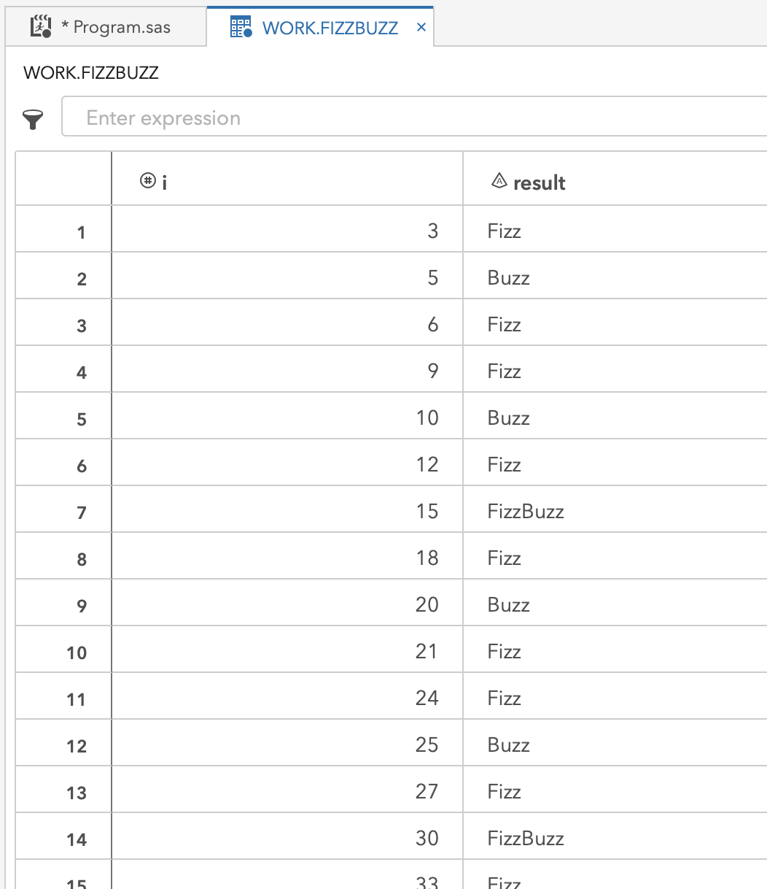

---

## FizzBuzz with SAS Viya's CAS engine
Expanding the SAS implementation to use SAS Viya's CAS engine for easy multi-threaded computing.

---

### Replicating the single-threaded approach of SAS with the SAS Viya multi-threaded CAS runtime

Running the process above in SAS triggers a sequential execution for each value of `i`.  SAS now has a runtime called Cloud Analytics Services (CAS), which is part of SAS Viya.  To briefly explain this environment before we move on, I am borrowing content from a previous blog post that you can visit for more details: [Bootstrap Resampling At Scale: Part 1 (of 3)](#background--setup)

>|Slide 3 (Click-to-Play)|
>|:--:| 
>||
>
>- In the animation above (click-to-play), we see the key components of SAS Viya displayed.  
>   - The first part is a SAS 9.4 workspace.  This component gives users a working SAS 9 session when they log into a SAS interface, such as SAS Studio.
>   - The second part is called CAS, a distributed computing environment made up of multiple servers working together.
>   - The CAS controller conducts the orchestration of work within CAS. Instructions are received and distributed to threads assigned to each processor in the CAS environment.
>   - The actual computation happens on CAS workers where each machine's processors have an assignment to computing threads. An environment can contain any number of CAS workers.

Using this information about the architecture, we can replicate our SAS approach in CAS, SAS Viya.  If we just submit the code without a change, it automatically runs in SAS 9 as it did previously.  To direct the execution to CAS, we need two things:
- A SAS Viya CAS session
- libname definition that points to CAS in-memory space

This code snippet starts a CAS session with alias name `mysess`.  Within the session, the following `libname` has alias name `mycas` that points to the session created with name `mysess`.

```sas
/* setup a cas session */
    cas mysess;
    libname mycas cas sessref=mysess;
```

The following log shows a successful session created on a CAS environment with 27 worker nodes.

```
NOTE: The session MYSESS connected successfully to Cloud Analytic Services eecucs05.unx.sas.com using port 5570. The UUID is 
      30195d31-43df-e240-8ba1-f3d67f22bab3. The user is mihend and the active caslib is CASUSERHDFS(mihend).
NOTE: The SAS option SESSREF was updated with the value MYSESS.
NOTE: The SAS macro _SESSREF_ was updated with the value MYSESS.
NOTE: The session is using 27 workers.
77    libname mycas cas sessref=mysess;
NOTE: Libref MYCAS was successfully assigned as follows: 
      Engine:        CAS 
      Physical Name: 30195d31-43df-e240-8ba1-f3d67f22bab3
```

To point the existing SAS data step execution to the CAS workers but still run single-threaded, the only changes needed are:
- point the output table `FizzBuzz` to the CAS `libname` we called `mycas`
- add an option to the data step that instructs it to use a single thread for computing with `/ single=yes` 

```sas
/* single thread CAS version */
    data mycas.FizzBuzz / single=yes;
        do until(i = 10000);
            i+1;
            result = strip(ifc(mod(i,3)=0,ifc(mod(i,5)=0,'FizzBuzz','Fizz'),ifc(mod(i,5)=0,'Buzz',put(i,8.))));
            output;
        end;
    run;
```

The log results are very similar to the previous execution in SAS, and they contain confirmation that the execution is happening in CAS.

```
NOTE: Running DATA step in Cloud Analytic Services.
NOTE: The table FizzBuzz in caslib CASUSERHDFS(mihend) has 10000 observations and 2 variables.
NOTE: DATA statement used (Total process time):
      real time           0.23 seconds
      cpu time            0.01 seconds
```

---
### Invoking threads

Now that we know how to take the multi-threaded environment of CAS and work with a single thread, we can expand the approach to use all the threads.  I unravel and expand this concept in this and the next sections.

First, just changing `/ single=yes` to `/ single=no` tells the data step code to send the instructions to all available computing threads in CAS.  In this case, there is no input dataset, and the data step code creates the output dataset directly from the instructions.  By changing this one part of the code, it sends the instructions, the same instructions, to each of the threads, which have an assignment to processing cores across all CAS workers.

```sas
/* many thread version */
    data mycas.FizzBuzz / single=no;
        do until(i = 10000);
            i+1;
            result = strip(ifc(mod(i,3)=0,ifc(mod(i,5)=0,'FizzBuzz','Fizz'),ifc(mod(i,5)=0,'Buzz',put(i,8.))));
            output;
        end;
    run;
```

The log looks very similar, and the run time is even barely shifted.  The difference is that there are now 370,000 output observations instead of the 10,000 expected.  This CAS environment has 27 workers that combine for 370 threads.  Each thread executed the same evaluation of `i = 10000` separately, so 370 separate but the same values, all in parallel.  While this is not the end goal, it is impressive that such a small code change can trigger massive parallelism in code. 

```
NOTE: Running DATA step in Cloud Analytic Services.
NOTE: The table FizzBuzz in caslib CASUSERHDFS(mihend) has 3700000 observations and 2 variables.
NOTE: DATA statement used (Total process time):
      real time           0.63 seconds
      cpu time            0.02 seconds
```

The output in `mycas.FizzBuzz`, filtered to a single value of `i`, `i=15` for example, show that there are many evaluations of this single value, 370 to be exact.  

>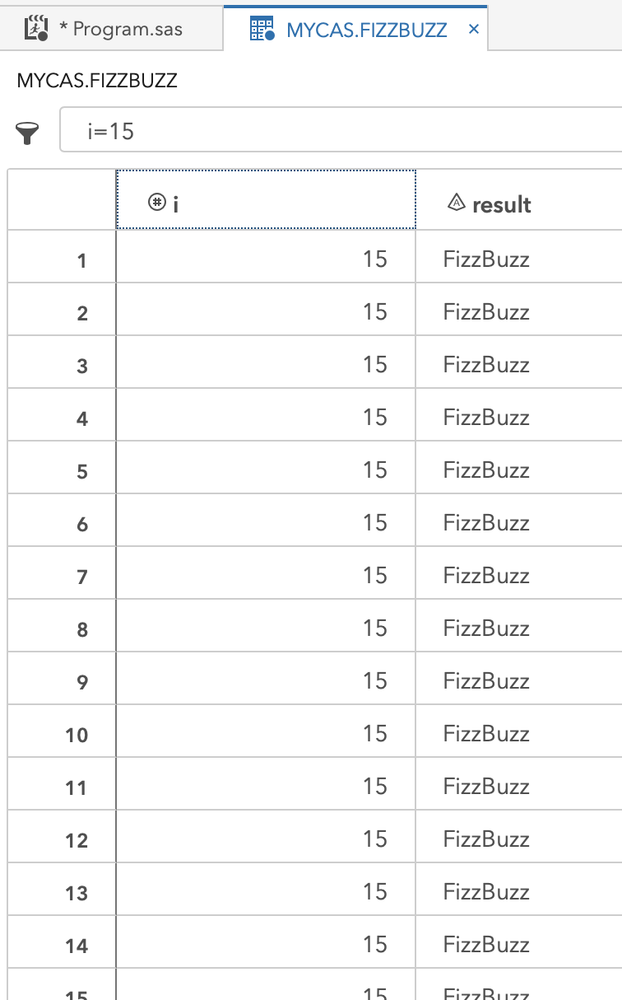

---
### Understanding threads

The goal is to harness all the computing threads to simultaneously work on a range of values for `i` to evaluate the range faster ultimately.  First, it is essential to understand how to see and use environment information.

During execution, the data step executing within CAS has access to system variables with key information like the id of the thread, `_threadid_`, and the name of the machine containing the computing core it is allocated to, `_hostname_`.  The following data step uses the `/ single=no` execution option to send instructions to all threads and then instructs each to return the machine name and thread name of each thread. 

```sas
/* how many threads? hosts? */
    data mycas.seethreads / single=no;
        host=_hostname_;
        thread=_threadid_;
        put host thread;
    run;
```

The screen below shows that threads 1-12 are on a single host, then threads 13-24 are on yet another host.  It goes on for all 23 hosts in this CAS environment.  Some of the hosts even have different numbers of threads in this environment.  With this information, it is possible to start thinking of ways to alter the instructions on each thread to have it evaluate a different range of values for `i`.

>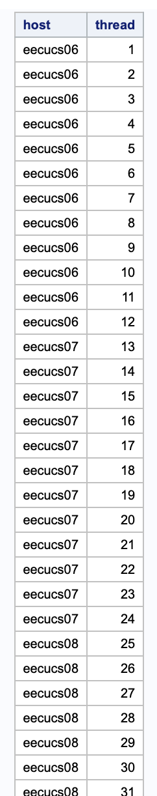

---
### Putting all threads to work

In this section,  the `_threadid_`, is used to manipulate the range of `i` that each thread evaluates.  Here is a review of the changes to the code here:
- store the size of `i` in a macro variable `fbsize` so it is easy to reuse multiple times in the code
- capture the `_threadid_` in a variable named thread
    - note that the CAS environment assigns sequential integers as the id values for threads
- initialize the value of `i` on each thread to be the value of `_threadid_` minus 1 then multiple by `fbsize`, the number of `i` evaluation to do on the thread
    - making `i=0` the initial value of the first thread, and so on
- create a stopping, last value, of `i` for each thread called `s` that is `fbsize=10000` higher than the starting value stored in `i`

FizzBuzz on SAS Viya CAS - all threads doing unique work
```sas
/* do work on each thread in cas */
    %LET fbsize = 10000;
    data mycas.FizzBuzzMPP / single=no;
        thread=_threadid_;
        i = (thread - 1) * &fbsize; /* start value for i on the thread */
        s = i + &fbsize; drop s; /* stop value for i on the thread */
        do until(i = s);
            i+1;
            result = strip(ifc(mod(i,3)=0,ifc(mod(i,5)=0,'FizzBuzz','Fizz'),ifc(mod(i,5)=0,'Buzz',put(i,8.))));
            output;
        end;
    run;
```

The log reveals that there are still 370 times more evaluations than the single-threaded approach, but now there should be 370,000 unique values of `i`.

```
NOTE: Running DATA step in Cloud Analytic Services.
NOTE: The table FizzBuzzMPP in caslib CASUSERHDFS(mihend) has 3700000 observations and 3 variables.
NOTE: DATA statement used (Total process time):
      real time           0.44 seconds
      cpu time            0.01 seconds
```

The view of the resulting `mycas.FizzBuzz` data set found below is filtered to see just the 14th value of `i` evaluated on each thread.  It is clear that each thread evaluates a different range of values for `i`.  With a little bit of integer math, the data step evaluates 370,000 `i` values rather than the single-threaded approach with 10,000 and achieves a runtime that is nowhere near 370 times longer. Parallelism with just 4 more code statements, of which two are optional!

>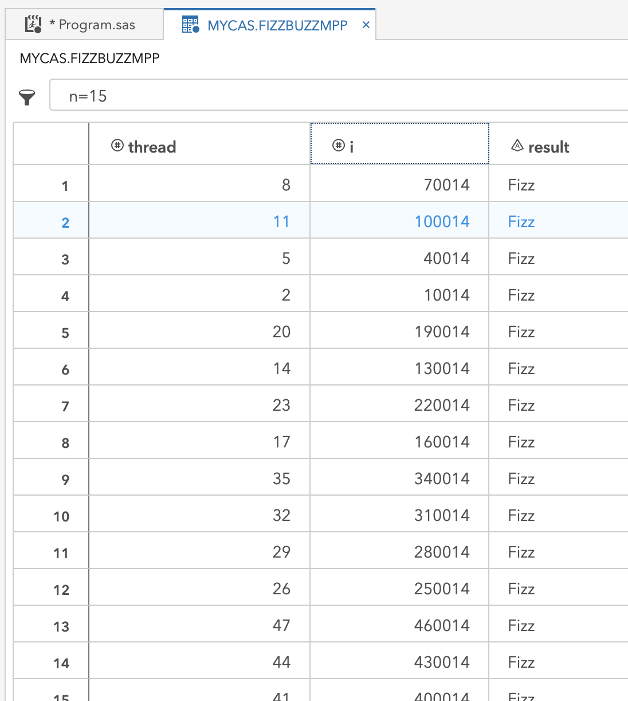

---
### Orchestrating threads to work together
This next extension of the code uses more integer arithmetic to spread the range of `i` evenly across all the threads rather than just asking each thread to work on a fixed range.  Remember that a thread in CAS allocates to a computing core, so this is an optimal division of work and not just creating separate processes and letting an operating system manage contention for resources.  By knowing the number of threads, it is possible to evenly partition the effort for each work unit, a thread.  If the range of `i` is not evenly divisible by the number of threads, this method adds any extras to the last thread.  The new features in this version of the FizzBuzz code summarized and followed by the code:

- store the range for each thread in `part_size`, the value of `i` divided by the number of threads
- make the starting value of `i`
    - calculate the number of evaluations on lower number threads with `(thead-1) * part_size`
- create the stopping value of `i` for the thread
    - add `part_size` to `i`
    - if it is the last thread, `thread = &threads`, set the stopping value to `&fbsize` to ensure inclusion of any remainder from the `part_size` division

```sas
/* spread the work over all threads */
%LET threads = 370;
%LET fbsize = 10000;
data mycas.FizzBuzzMPP / single=no;
    part_size = int(&fbsize/(&threads)); drop part_size;
    thread=_threadid_;

    i = (thread - 1) * part_size;
    s = i + part_size; drop s;
    if thread = &threads then s = &fbsize;
    do until(i = s);
        i+1;
        result = strip(ifc(mod(i,3)=0,ifc(mod(i,5)=0,'FizzBuzz','Fizz'),ifc(mod(i,5)=0,'Buzz',put(i,8.))));
        output;
    end;
run;
```

The log shows that the requested 10,000 iterations resulted in a dataset with only 10,000 observations as expected.  This small computation divided over 370 dedicated threads barely even registers a CPU time.  In the next step, a much larger `fbsize` is considered.

```
NOTE: Running DATA step in Cloud Analytic Services.
NOTE: The table FizzBuzzMPP in caslib CASUSERHDFS(mihend) has 10000 observations and 3 variables.
NOTE: DATA statement used (Total process time):
      real time           0.20 seconds
      cpu time            0.01 seconds
```

The code is rerun with `fbsize = 1000000000` to see how long 1 billion integers take to evaluate on 370 dedicated threads.  The code gets slightly altered to only output rows that match `Fizz` or `Buzz`.  

```sas
/* spread the work over all threads */
%LET threads = 370;
%LET fbsize = 1000000000;
data mycas.FizzBuzzMPP / single=no;
    part_size = int(&fbsize/(&threads)); drop part_size;
    thread=_threadid_;

    i = (thread - 1) * part_size;
    s = i + part_size; drop s;
    if thread = &threads then s = &fbsize;
    do until(i = s);
        i+1;
        result = strip(ifc(mod(i,3)=0,ifc(mod(i,5)=0,'FizzBuzz','Fizz'),ifc(mod(i,5)=0,'Buzz','')));
        if missing(result)=0 then output;
    end;
run;
```

The resulting 466,666,667 integers that are either `Fizz` or `Buzz` all correctly evaluate and write to dataset `FizzBuzzMPP` in only 28.08 seconds.  Impressive! 

```
NOTE: Running DATA step in Cloud Analytic Services.
NOTE: The table FizzBuzzMPP in caslib CASUSERHDFS(mihend) has 466666667 observations and 3 variables.
NOTE: DATA statement used (Total process time):
      real time           28.08 seconds
      cpu time            0.42 seconds
```

Take a look at the last integers on the way up to 1 billion and the evaluated results below.  In under 30 seconds, this code: 
iterated over each integer
- evaluates for `Fizz`
- evaluates for `Buzz`
- evaluates for `FizzBuzz`
- evaluates to see if any matches occurred, 
- outputs and writes the results to the file `FizzBuzzMPP`

This code meets the goals of speed in computation and speed of coding, with only 14 lines of code, of which some can be considered optional.  Wow!

>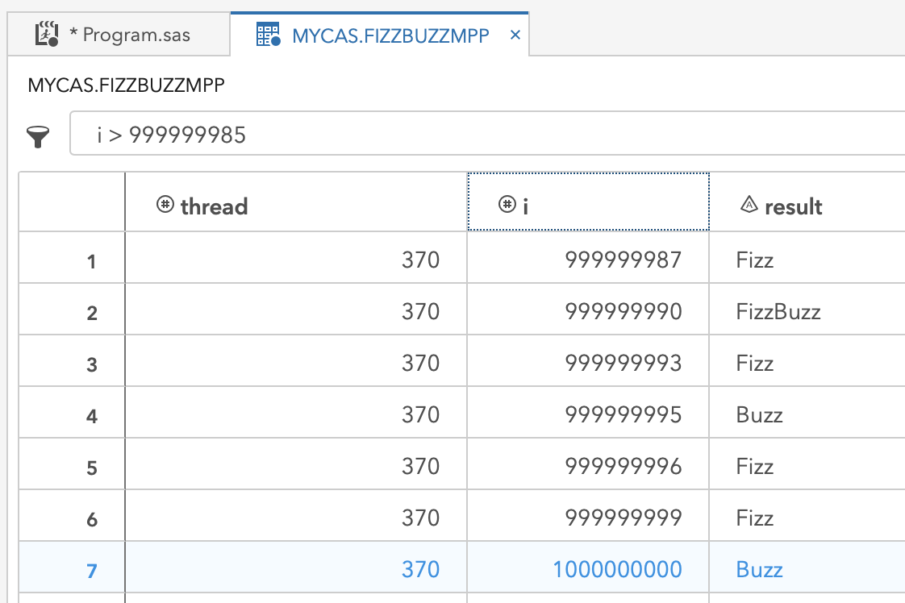

---

## Bonus Sections
Adapting the SAS data step code to the SAS CASL language for directly computing in CAS and then using CASL from Python with the SWAT API. That is many acronyms!

---

### Using SAS Viya CASL coding

When the data step above points to `libname mycas` SAS knows to direct computations to the CAS environment.  Another way to do this is by using the SAS CASL language within PROC CAS.  Think of PROC CAS as a gateway directly into CAS where you write code that is directly computed by the CAS controller on the CAS workers.  An open CAS session is still required.

The CASL language does not have SAS macro variable facility.  Instead, it can directly declare variables and use them - more on that in the [next section](#using-sas-viya-casl-coding-from-python).  Since we are coming from a SAS session, PROC CAS resolves macro variables in the PROC CAS code.  To extend the example above the following changes are made:
- wrap the data step in PROC CAS
- store the text of the data step in a variable, `dscode` in this example
    - remove the libname reference, `mycas` as this is directly computing against CAS and does not need the pointer to see the data set like SAS does
    - remove the `/ single = no` as it is placed in a different place
- declare the action `datastep.runcode` and specify options:
    - point the `code` option to the stored data step code in `dscode`
    - give option `single` a value of `no`

Getting information about the resulting `FizzBuzzMPP` table requires a few more action steps:
- action `table.tableDetails` is used on the table `FizzBuzzMPP` to view information about the data set in the CAS environment
- using the action `table.tableDetails` with `level="NODE"`, further breaks down the information about `FizzBuzzMPP` by the worker machine, called a node, in the CAS environment

```sas
%LET threads = 370;
%LET fbsize=1000000000;
proc cas;
    dscode="
        data FizzBuzzMPP;
            part_size = int(&fbsize/(&threads)); drop part_size;
            thread=_threadid_;

            i = (thread - 1) * part_size;
            s = i + part_size; drop s;
            if thread = &threads then s = &fbsize;
            do until(i = s);
                i+1;
                result = strip(ifc(mod(i,3)=0,ifc(mod(i,5)=0,'FizzBuzz','Fizz'),ifc(mod(i,5)=0,'Buzz','')));
                if missing(result)=0 then output;
            end;
        run;";
    datastep.runcode / code=dscode single='no';

    table.tableDetails / table="FizzBuzzMPP";
    table.tableDetails / table="FizzBuzzMPP" level="NODE";
run;
```

The output below returns from the two `table.tableDetails` actions calls.  The first result table shows that all 466,666,667 rows of output are stored and gives some information about how it is stored.  The second results table breaks the information down by node, which is a view of how the rows get partitioned to the different worker machines.  Each machine does not have an equal number of rows in this case, which is likely explained by the machines having differing cores.  

**Additional introduction to CAS tables information:**
>For very small tables, not every machine or every thread may get data allocated to it.  If there is a by-variable, then all rows associated with a by level are on the same thread, therefore the same machine.  If the number of by-levels is less than the number of threads, then some threads do not have rows allocated.  When the number of by-levels exceeds the number of threads, then each thread can have multiple by-levels in its partition of rows in a way that creates balance across the environment.

>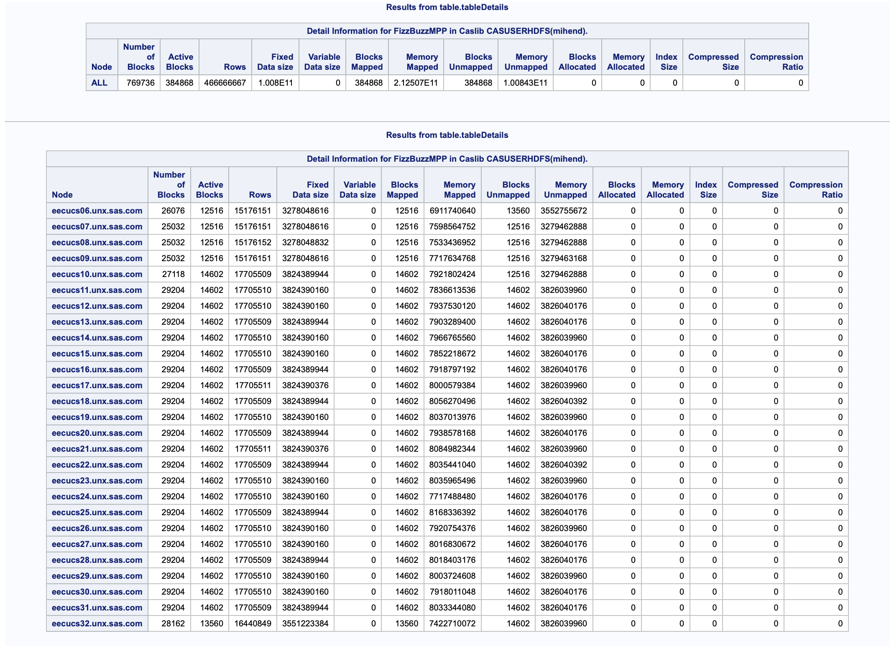

---

In the next section, this CASL code is modified for use from Python.  Before exiting SAS, it is good to remember any active CAS session and issue a termination.  The following short snippet stops the session and clears any CAS tables that are in the scope of the session.

```sas
/* end the cas session */
    cas mysess clear;
```

**Additional introduction to CAS tables information:**
> Tables exist in a caslib, like `mycas` in these examples.  Each caslib has a scope.  These examples use a caslib to the CAS session which results in session scope.  The tables vanish when the session ends.  Another type of scope exists called global.  A globally scoped caslib gives one or more users access to tables across any session. For instance, the automatic caslib `CASUSER` is global and can only be accessed by a specific user. The global scope allows a user, or process, to persist a table between sessions without recreating or reloading it in later sessions.  Similarly, a group of users can share tables with a globally scoped caslib.  

---
### Using SAS Viya CASL coding from Python

Using SAS today can still mean using a workflow in the language of choice for any project.  Python is a language I find myself using very often. In this section, I take the concepts shown in [Using SAS Viya CASL Coding](#using-sas-viya-casl-coding) and use them directly in Python, specifically Python 3.  Using the [SWAT](https://github.com/sassoftware/python-swat) Python library enables direct communication with the CAS controller.  Let's take the example step-by-step in Python below.

Create a CAS session from Python:
- import the swat library to enable using CAS from Python
- create a CAS session
    - for this example, it is still called `mysess`
    - in Python, we use assignment, `=` sign, to the `swat.CAS` function with host location and login information

```python
import swat
mysess=swat.CAS('localhost',8777,'sasdemo','sasdemo',protocol='http')
```

Within the `mysess` session, the CAS action is directly called.  In this example, a data step runs to examine the value of the automatic environment variables for viewing the number of available threads.  This example is using a container with constrained resources.
- run `datastep.runcode` directly in the session with `mysess.datastepruncode` and put the data step code in the `code=` parameter along with the parameter `single='no'`

```python
mysess.dataStep.runCode(code='''data _null_;  put _hostname_ _threadid_ _nthreads_; run;''', single='no')
```

This data step returns the hostname, and thread number for each thread in the CAS environment `mysess` is running in.  In this case, it is a single machine with 8 computing threads.  The information is returned to Python and looks like this:

```
sas-programming 4 8
sas-programming 2 8
sas-programming 8 8
sas-programming 3 8
sas-programming 1 8
sas-programming 7 8
sas-programming 6 8
sas-programming 5 8
```

Knowing the number of threads (8) and the desired number of integers to evaluate (1000) allows us to define these as parameters.  Rather than macro variables, these get directly assigned and used within the assignment of `dscode` that holds the data step code.  

```python
threads = 8
fbsize = 1000

dscode='''data FizzBuzzMPP;
            part_size = int(''' + str(fbsize) + '''/(''' + str(threads) + ''')); drop part_size; 
            thread=_threadid_; 
            i = (thread - 1) * part_size;
            s = i + part_size; drop s;
            if thread =''' + str(threads) + '''then s = ''' + str(fbsize) + ''';
            do until(i = s);
                i+1;
                result = strip(ifc(mod(i,3)=0,ifc(mod(i,5)=0,'FizzBuzz','Fizz'),ifc(mod(i,5)=0,'Buzz',put(i,8.))));
                if missing(result)=0 then output;
            end;
        run;'''
```

The code exectution is triggered with the already familiar `datastep.runcode` action from `mysess`:

```python
mysess.datastep.runcode(code=dscode, single='no')
```

If you are using a Jupyter notebook, then the output looks like:

>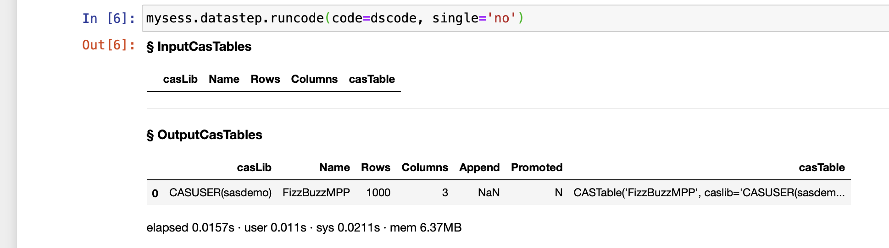

The details of the table can are examined with the `table.tabledetails` action:

>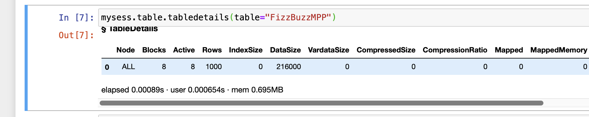

To view the first few rows of the output table the `table.fetch` action is useful, in this case, with `to=15` to output 15 rows.

```python
mysess.table.fetch(Table="FizzBuzzMPP",to=15)
```

>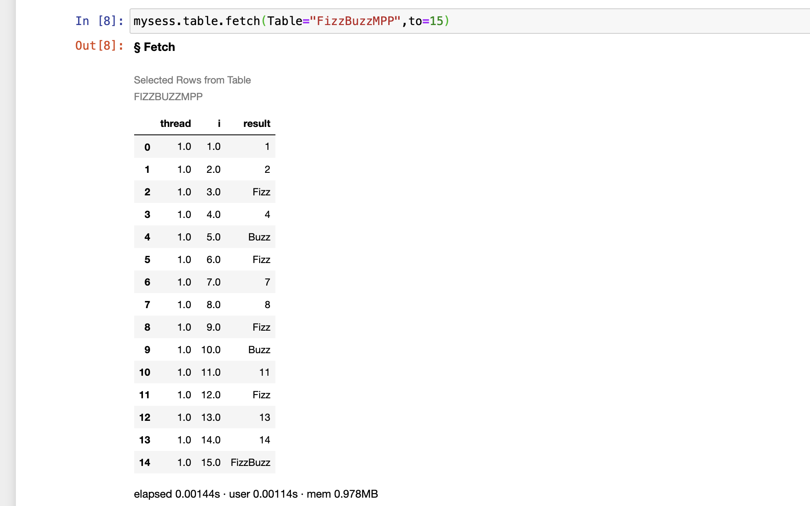

For returning the first 15 rows in Python, instinct is to use the `head()` function in Pandas.  SAS Viya's CAS runtime has Pandas functions overloaded so that the familiar syntax gets used directly, it works multi-threaded, and does not require importing Pandas.  
- store the table assignment in a variable, `fb` in this case
- within a Python print function use the `head(15)` request for table `fb`

```python
fb=mysess.CASTable("FizzBuzzMPP")
print(fb.head(15))
```

>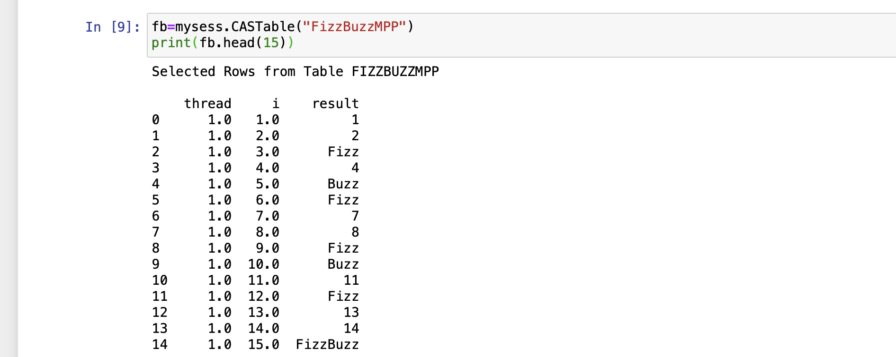

Show the first 2 rows of each thread using the familiar pandas `groupby()` function:

```python
print(fb.groupby('thread').head(2))
```

>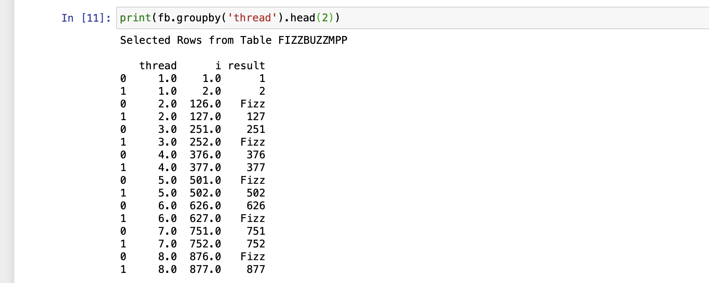

When done with CAS, close the session:

```python
mysess.close()
```

**Additional introduction to CAS coding from Python:**
>Using the basic principles shown here, it is easy to see a new way of interacting with SAS using CASL from Python.  By initiating a workflow from Python it would be simple to manage multiple sessions, eliminate the need for the macro language, and use familiar pandas syntax on large tables with multi-threading benefits.  It is also straightforward to incorporate other familiar libraries and leverage the tools of choice for different parts of a workflow, all from a single Python driven process. This SWAT package is also available for R, REST, Java, and LUA!

---

## Wrap-up
This blog post ended up being much bigger than I initially intended.  The hope is that this way of examining a common, simple challenge, has been helpful. For a deeper understanding of a language, expanding your impression of a new SAS, and even using multiple tools together in a single, more productive workflow!  I welcome your feedback and questions.