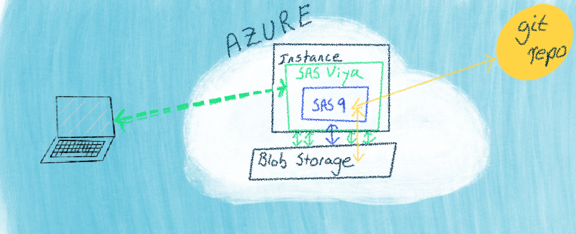

Many users of SAS have spent their time using what is commonly called "PC SAS."  
In this setup, they write and run SAS code on a local personal machine.  The choices for authoring SAS code have evolved, with the most recent being SAS Studio, a browser-based interface. It is now even easier to conceptualize moving the running of a SAS program to virtually anywhere.  This post starts with this backdrop and shows moving the SAS platform to Microsoft Azure and using SAS Studio to work with files in the Azure infrastructure.  

Before getting into the details of this move, I am going to explain SAS and SAS Viya briefly.  SAS Viya makes moving to the cloud much more accessible from an architecture and deployment perspective.  That does not have to be a scary thing for us users of SAS.  In the following drawing, I show how my mind sees SAS Viya.  It is a superset of the SAS we know, SAS 9, and a new SAS, SAS Viya.  While there are many reasons to love the enhanced parts, it is vital to trust that the familiar SAS 9 parts are still present and still work as expected!  The drawing shows how data sources can move to the cloud, and SAS can migrate with them while still allowing the SAS user to run their SAS code through a web-based interface, like SAS Studio.  

>

With this as our backdrop, let's proceed to see a specific example of using SAS via SAS Studio in Microsoft Azure.

# First Steps with Azure and SAS

The basic concerns of a SAS user in the cloud are how they will work with files and access data.  In this Microsoft Azure example, we use blob storage to store our files (code and data) while also connecting to and working with remote git repositories.  In this series of video snippets, I show files in Azure, navigating them in SAS Studio, reading and writing to files, and working with a remote git repository.  A conceptual architecture looks like:

>

## Outline
- [Introduction](#introduction)
- [Files: Storing Files in Azure Blob Storage](#files-storing-files-in-azure-blob-storage)
- [Files: Navigating Azure Blob Storage from SAS](#files-navigating-azure-blob-storage-from-sas)
- [SAS: Writing to Azure Storage](#sas-writing-to-azure-storage)
- [SAS: Reading from Azure Storage](#sas-reading-from-azure-storage)
- [Git: Using SAS To Clone A Remote Git Repository to Azure Storage](#git-using-sas-to-clone-a-remote-git-repository-to-azure-storage)
- [Git: Working with A Git Repository from SAS](#git-working-with-a-git-repository-from-sas)

---

## Introduction

><iframe width="560" height="315" src="https://www.youtube.com/embed/vZ8Jv4ird-s?start=0&end=10&version=3" frameborder="0" allow="accelerometer; autoplay; encrypted-media; gyroscope; picture-in-picture" allowfullscreen></iframe>

---

## Files: Storing Files in Azure Blob Storage

Navigating files with Azure Portal:

><iframe width="560" height="315" src="https://www.youtube.com/embed/vZ8Jv4ird-s?start=11&end=31&version=3" frameborder="0" allow="accelerometer; autoplay; encrypted-media; gyroscope; picture-in-picture" allowfullscreen></iframe>

---

## Files: Navigating Azure Blob Storage from SAS

Using [blobfuse](https://docs.microsoft.com/en-us/azure/storage/blobs/storage-how-to-mount-container-linux) to enable navigating the same blob storage files from SAS Studio:

><iframe width="560" height="315" src="https://www.youtube.com/embed/vZ8Jv4ird-s?start=32&end=71&version=3" frameborder="0" allow="accelerometer; autoplay; encrypted-media; gyroscope; picture-in-picture" allowfullscreen></iframe>

---

## SAS: Writing to Azure Storage

Writing SAS output to blob storage:

><iframe width="560" height="315" src="https://www.youtube.com/embed/vZ8Jv4ird-s?start=72&end=138&version=3" frameborder="0" allow="accelerometer; autoplay; encrypted-media; gyroscope; picture-in-picture" allowfullscreen></iframe>

---

## SAS: Reading from Azure Storage

Reading input into SAS from blob storage:

><iframe width="560" height="315" src="https://www.youtube.com/embed/vZ8Jv4ird-s?start=138&end=184&version=3" frameborder="0" allow="accelerometer; autoplay; encrypted-media; gyroscope; picture-in-picture" allowfullscreen></iframe>

---

## Git: Using SAS To Clone A Remote Git Repository to Azure Storage

Cloning a remote git repository and navigating it with SAS Studio:

><iframe width="560" height="315" src="https://www.youtube.com/embed/vZ8Jv4ird-s?start=185&end=305&version=3" frameborder="0" allow="accelerometer; autoplay; encrypted-media; gyroscope; picture-in-picture" allowfullscreen></iframe>

---

## Git: Working with A Git Repository from SAS

Working with git managed files from SAS Studio:

><iframe width="560" height="315" src="https://www.youtube.com/embed/vZ8Jv4ird-s?start=306&end=391&version=3" frameborder="0" allow="accelerometer; autoplay; encrypted-media; gyroscope; picture-in-picture" allowfullscreen></iframe>

---

## Wrap-up
There are many reasons and many flavors of moving from a local analytics environment to a cloud environment.  The excellent news is SAS has many ways of making a move positive and beneficial, through enhanced capabilities.  It is not a lift-and-shift; it is a move-and-grow!  This post is a simple example of a typical first move.  The new capabilities enabled by cloud computing are a good topic for another post.  Let me know your thoughts!